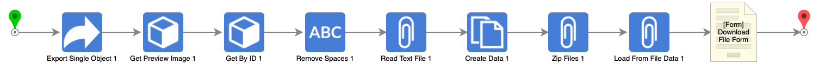

 
Flow Name: Post Flow To GitHub

Description: 
Takes a screenshot of the flow, exports the flow and then makes the readme.md for github to display the screenshot and the information for that flow

 

